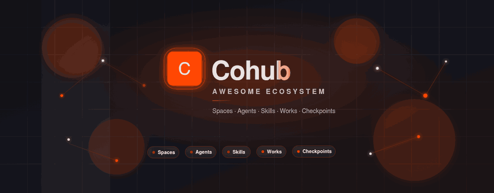

<p align="center">
  <a href="https://cohub.run">
    
  </a>
</p>

<p align="center">
  <a href="assets/banner.svg"></a>
</p>

<br/>

<div align="center">
  <strong>
    A curated list of the Cohub ecosystem — Spaces, Agents, Skills, Works, CLI, and community resources.
    <br />
    Hand-picked for people building with people and agents.
  </strong>
  <br />
  <br />
</div>

<div align="center">

[](https://awesome.re)
[](https://cohub.run)
[](https://www.npmjs.com/package/@neta-art/cohub-cli)
[](LICENSE)

</div>

# Awesome Cohub

> Your own space to create, play, and build with people and agents.

[Cohub](https://cohub.run) is a living Space for people and agents. Start anywhere, make in any medium, share as Works.

This repository curates the best public entry points into the Cohub ecosystem:

- product surface and docs
- CLI / SDK
- official skills
- core concepts (Space, Checkpoint, Work, Channel)
- community tools, examples, and related projects

Inspired by the [Awesome](https://awesome.re) format and the VoltAgent awesome series presentation style.

## Contents

- [Official](#official)
- [Core Concepts](#core-concepts)
- [Product Surface](#product-surface)
- [CLI and SDK](#cli-and-sdk)
- [Official Skills](#official-skills)
- [Platform Architecture](#platform-architecture)
- [Related Projects](#related-projects)
- [Learning Resources](#learning-resources)
- [Contributing](#contributing)

## Official

- **[Cohub](https://cohub.run)** - Browser-first creative space for people and agents.
- **[Cohub monorepo](https://github.com/talesofai/cohub)** - Source for API, agent, sandbox, gateway, web, and packages.
- **[neta-art](https://github.com/neta-art)** - GitHub org around the Cohub / Neta ecosystem.

## Core Concepts

- **Space** - Live, isolated creative surface with chats, files, tasks, previews, and agents.
- **Checkpoint (Save)** - Immutable snapshot of a Space at a meaningful moment.
- **Proposal** - Collaboration flow for bringing checkpoint work back into another Space.
- **Session (Chat)** - Conversation context inside a Space.
- **Agent** - Active collaborator operating inside a Space.
- **Channel** - External entry point such as Discord, Telegram, Feishu, or WeChat.
- **Sandbox** - Execution runtime behind a Space.
- **Work** - Public share of a file, directory site, or live port from a Space.

## Product Surface

- **Spaces** - Create, fork, save, and collaborate in isolated environments.
- **Checkpoints / Saves** - Freeze progress and remix from a stable base.
- **Works** - Publish demos, pages, and live previews with shareable URLs.
- **Multimodal generation** - Text, image, video, and music generation from Space context.
- **External channels** - Talk to a Space from chat apps and CLIs.
- **Cross-space references** - Point agents at other Spaces with `@space` context.

## CLI and SDK

- **[@neta-art/cohub-cli](https://www.npmjs.com/package/@neta-art/cohub-cli)** - Official CLI for spaces, sessions, prompts, files, generation, and automation.
- **[@neta-art/cohub](https://www.npmjs.com/package/@neta-art/cohub)** - TypeScript SDK for spaces, sessions, checkpoints, and realtime collaboration.
- **[cohub-desktop](https://github.com/markbang/cohub-desktop)** - Desktop companion prototype for Cohub.

### Install CLI

```bash
npm install -g @neta-art/cohub-cli
cohub --help
```

### Common commands

```bash
cohub auth login
cohub spaces ls
cohub -s <space-id> prompt "Build a landing page"
cohub generate "neon city skyline at dusk" --model <model>
cohub -s <space-id> spaces files ls
```

## Official Skills

Skills teach agents how to operate Cohub well.

| Skill | Description |
|---|---|
| **[cohub](https://github.com/talesofai/cohub/tree/main/skills/cohub)** | Spaces, chats, files, saves, labels, search, tasks, scheduled prompts, cross-space run |
| **[cohub-generate](https://github.com/talesofai/cohub/tree/main/skills/cohub-generate)** | Image, video, and music generation via `cohub generate` |
| **[cohub-works-share](https://github.com/talesofai/cohub/tree/main/skills/cohub-works-share)** | Publish files, directory sites, or ports as public Works |
| **[public-share](https://github.com/talesofai/cohub/tree/main/skills/public-share)** | Publish runtime files to `/public` and return direct public URLs |

### Why skills matter

Cohub agents become useful when they know:

1. which product nouns map to which CLI commands
2. how to keep outputs inside Space conventions
3. how to publish Works and share results cleanly
4. how to run multimodal generation without inventing fake APIs

## Platform Architecture

High-level shape of the Cohub monorepo:

```text
cohub/
├── apps/
│   ├── api/        # Hono API — orchestration, provisioning, session persistence
│   ├── agent/      # Agent control service
│   ├── sandbox/    # Sandbox executor
│   ├── gateway/    # External channel gateway
│   ├── web/        # SvelteKit web app
│   └── worker/     # Cron and async task processing
├── packages/
│   ├── protocol/   # Shared types and protocols
│   ├── sdk/        # Client SDK
│   └── cli/        # Cohub CLI
├── skills/         # Official agent skills
└── docs/           # Product and architecture docs
```

### Stack

- **Language**: TypeScript + Go
- **Frontend**: SvelteKit
- **Backend**: Hono
- **Database**: PostgreSQL + Drizzle ORM
- **Infra**: Kubernetes
- **Package manager**: pnpm monorepo

## Related Projects

Community and adjacent projects that pair well with Cohub workflows.

- **[awesome-agent-skills](https://github.com/VoltAgent/awesome-agent-skills)** - Broad curated catalog of agent skills across tools and ecosystems.
- **[awesome-design-md](https://github.com/VoltAgent/awesome-design-md)** - Brand `DESIGN.md` systems agents can apply to UI work.
- **[diffusionstudio/lottie](https://github.com/diffusionstudio/lottie)** - Text-to-Lottie skill pipeline for production motion assets.
- **[opencli](https://github.com/markbang)** - Local tooling experiments that complement Space automation.

> Have a Cohub-related project? Open a PR. See [Contributing](#contributing).

## Learning Resources

- **[Cohub README](https://github.com/talesofai/cohub/blob/main/README.md)** - Product pitch, concepts, and repo map.
- **[Co-creation model](https://github.com/talesofai/cohub/blob/main/docs/CO-CREATION-MODEL.md)** - Space / Checkpoint / Proposal mental model.
- **[Works guide](https://github.com/talesofai/cohub/blob/main/docs/works-guide.md)** - Publishing public Works.
- **[Self-hosting notes](https://github.com/talesofai/cohub/blob/main/docs/self-hosting.md)** - Deployment-oriented docs from the monorepo.

## Banner Assets

This repo ships a VoltAgent-style header treatment:

| File | Purpose |
|---|---|
| `assets/banner.svg` | Animated source banner (SMIL) |
| `assets/banner.gif` | README-friendly animated preview |
| `assets/banner.png` | Static poster frame |
| `assets/cohub-mark.svg` | Official-style Cohub mark |

Raw animated SVG:

```html
<a href="https://cohub.run">
  
</a>
```

## Contributing

Contributions welcome.

1. Keep entries useful, public, and Cohub-related.
2. Prefer short descriptions.
3. Add links under the most specific section.
4. Avoid AI-slop dumps and unmaintained placeholders.

See [CONTRIBUTING.md](CONTRIBUTING.md).

## License

[CC0 1.0 Universal](LICENSE) — public domain dedication for the list content.

---

<div align="center">
  <sub>Built for the Cohub ecosystem · <a href="https://cohub.run">cohub.run</a></sub>
</div>
